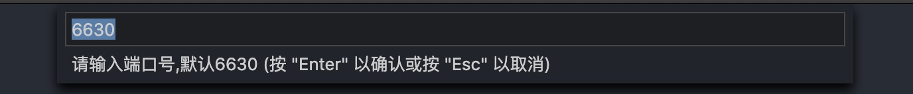
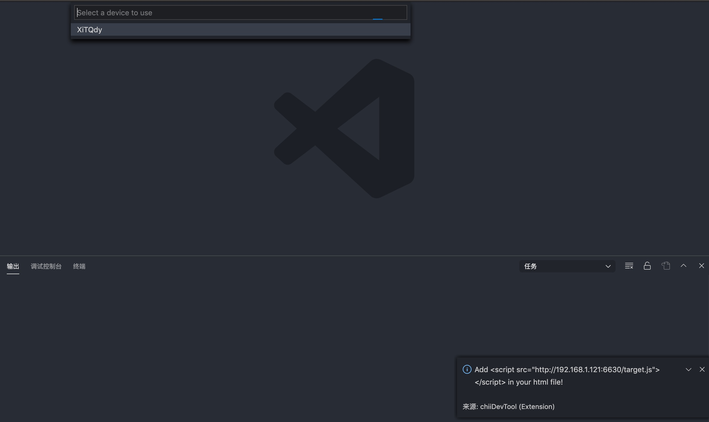
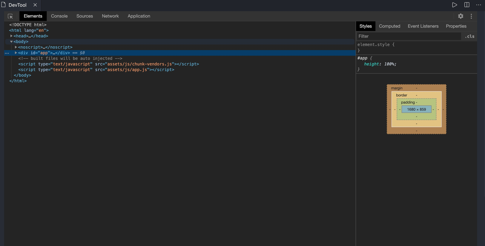

# chii-dev-tool

This project is build base on [chii](https://github.com/liriliri/chii)。

# Using chii-dev-tool

* Install the **chii-dev-tool** extension in VS Code.
* Click **启动调试(chii-dev-tool)** button on StatusBar
* Input your local **port**
* Copy information in message window to your app html
* Refresh your app
* Select connected devices in Pick dialog
* chii-dev-tool is work！

# 使用 chii-dev-tool

* 安装 vscode 扩展 **chii-dev-tool** .
* 在状态栏点击 **启动调试(chii-dev-tool)** 按钮
* 在弹出的输入框中，输入本地要启动的端口 **port**
* 复制弹出的消息窗口中的信息，放到你自己app的html中
* 刷新app页面
* 在vscode的选择框中，选择连接上的设备id
* chii-dev-tool is work！

# Step

 

 

 

 

**Enjoy!**
